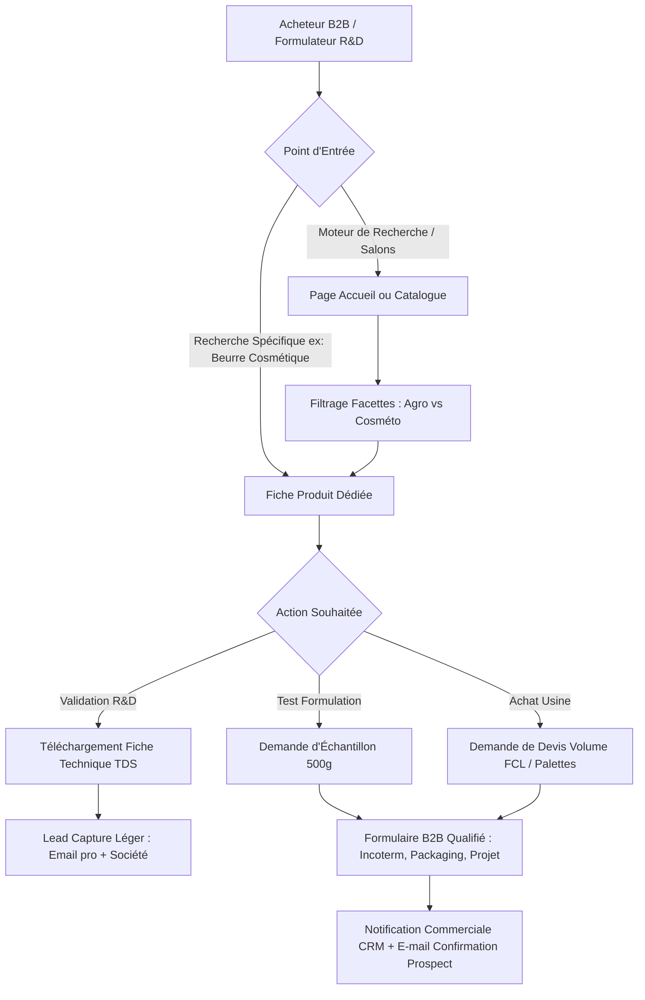
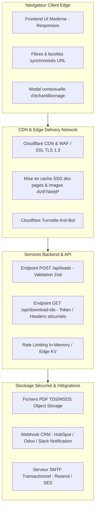
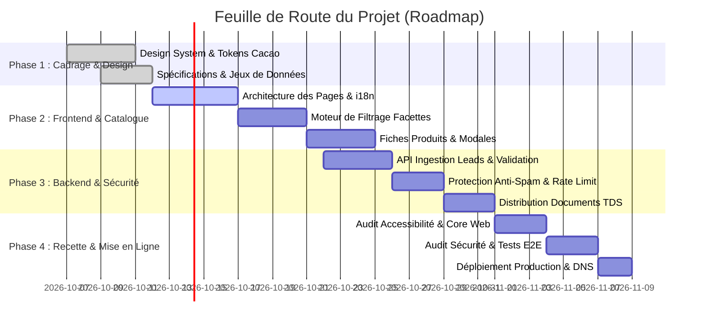

# Cahier des Charges Technique & Fonctionnel (CdCF)
## Plateforme Web B2B Internationale – Transformation Industrielle du Cacao

---

## Sommaire Exécutif
- [1. Présentation & Vision du Projet](#1-présentation--vision-du-projet)
  - [1.1 Contexte Industriel](#11-contexte-industriel)
  - [1.2 Cibles et Personas B2B](#12-cibles-et-personas-b2b)
  - [1.3 Proposition de Valeur & Objectifs Stratégiques](#13-proposition-de-valeur--objectifs-stratégiques)
- [2. Arborescence & Parcours Utilisateur (UX Flow)](#2-arborescence--parcours-utilisateur-ux-flow)
  - [2.1 Arborescence Complète du Site](#21-arborescence-complète-du-site)
  - [2.2 Cartographie des Parcours Utilisateur B2B](#22-cartographie-des-parcours-utilisateur-b2b)
- [3. Spécifications Fonctionnelles du Catalogue & Produits](#3-spécifications-fonctionnelles-du-catalogue--produits)
  - [3.1 Moteur de Filtrage à Facettes](#31-moteur-de-filtrage-à-facettes)
  - [3.2 Modèle de Données Produit (Schéma JSON/TypeScript)](#32-modèle-de-données-produit-schéma-jsontypescript)
  - [3.3 Anatomie & Wireframe Textuel d'une Fiche Produit Type](#33-anatomie--wireframe-textuel-dune-fiche-produit-type)
  - [3.4 Tunnel de Conversion B2B (Échantillons & Cotations Volume)](#34-tunnel-de-conversion-b2b-échantillons--cotations-volume)
- [4. Architecture Technique & Choix Technologiques](#4-architecture-technique--choix-technologiques)
  - [4.1 Architecture Globale du Système](#41-architecture-globale-du-système)
  - [4.2 Frontend : Performance, Accessibilité & Internationalisation](#42-frontend--performance-accessibilité--internationalisation)
  - [4.3 Backend & Services d'Intégration](#43-backend--services-dintégration)
  - [4.4 Gestion & Distribution Sécurisée des Documents (TDS / COA)](#44-gestion--distribution-sécurisée-des-documents-tds--coa)
- [5. Stratégie de Sécurité, Résilience & Conformité](#5-stratégie-de-sécurité-résilience--conformité)
  - [5.1 Protection Anti-Abus & Lutte Anti-Bot](#51-protection-anti-abus--lutte-anti-bot)
  - [5.2 En-têtes HTTP de Sécurité & Chiffrement](#52-en-têtes-http-de-sécurité--chiffrement)
  - [5.3 Conformité Réglementaire (RGPD & Mentions Légales B2B)](#53-conformité-réglementaire-rgpd--mentions-légales-b2b)
- [6. Organisation de l'Équipe d'Agents Spécialisés (.claude/)](#6-organisation-de-léquipe-dagents-spécialisés-claude)
- [7. Roadmap & Jalons de Développement](#7-roadmap--jalons-de-développement)

---

## 1. Présentation & Vision du Projet

### 1.1 Contexte Industriel
L'entreprise est une unité industrielle intégrée de première et seconde transformation de fèves de cacao sélectionnées. Elle transforme des matières premières brutes issues de terroirs contrôlés en ingrédients semi-finis de haute pureté destinés aux industriels mondiaux :
- **Beurres de cacao :**
  - *Alimentaire Naturel (Pressé)* : arôme cacao subtil, couleur dorée caractéristique, haute résistance thermique.
  - *Alimentaire Désodorisé Blanc Raffiné* : filtré et désodorisé par vapeur physique sous vide poussé, couleur claire, goût neutre pour chocolaterie blanche et biscuiterie fine.
  - *Cosmétique* : grade ultra-pur, texture fondante, émollient naturel sans solvant résiduel, certifié pour la dermocosmétique.
- **Poudres de cacao :**
  - *Poudre Naturelle (Non alcalinisée)* : pH 5.2 - 5.8, acidité fruitée d'origine, riche en polyphénols antioxydants.
  - *Poudre Alcalinisée 10-12% (Fat Content 10-12%)* : pH 7.0 - 7.6, solubilité optimisée, profil colorimétrique brun moyen à foncé.
  - *Poudre Alcalinisée 20-22% (Fat Content 20-22%)* : riche en matière grasse résiduelle, onctuosité supérieure, arôme intense pour chocolats chauds et crèmes desserts premium.
- **Masses de cacao & Dérivés :**
  - *Masse de cacao (Liqueur) alimentaire* : 100% pur cacao torréfié et broyé finement (< 20 microns), base noble du chocolat.
  - *Masse de cacao cosmétique* : grade spécifique pour masques et soins corporels riches en théobromine.
  - *Tourteau de cacao ("troutrou" / Press Cake)* : résidu solide du pressage du beurre, matière première pour broyage en poudres ou applications nutraceutiques/animales.

### 1.2 Cibles et Personas B2B
La plateforme s'adresse exclusivement à un public professionnel international :
1. **Directeur des Achats & Sourcing (Industrie Chocolatière / Biscuiterie / Glacerie)** : recherche des garanties de volumes constants, des prix compétitifs (FOB/CIF), le respect d'Incoterms stricts, et la régularité des approvisionnements (conteneurs FCL, camions citernes).
2. **Responsable R&D / Formulation (Laboratoires Cosmétiques & Pharma)** : exige des fiches de spécifications physico-chimiques complètes (TDS, indices d'iode, peroxyde, profil d'acides gras), la nomenclature INCI, des certificats d'analyse (COA) lot par lot et des échantillons laboratoire de 200g à 1kg pour tests de stabilité.
3. **Responsable Qualité & Conformité Réglementaire (QA / Compliance Manager)** : audite les certifications (FSSC 22000, ISO 9001, HACCP, Halal, Kosher, Ecocert/Bio) et la conformité au Règlement Européen Zéro Déforestation (**EUDR** 2023/1115).

### 1.3 Proposition de Valeur & Objectifs Stratégiques
- **Crédibilité & Prestige Industriel :** Positionner l'entreprise au même niveau d'exigence et d'élégance que les grands transformateurs mondiaux (Barry Callebaut, Cargill, Olam).
- **Génération de Leads Qualifiés :** Convertir le trafic ciblé en demandes d'échantillons et cotations fermes avec capture d'informations métier critiques.
- **Transparence & Traçabilité :** Rendre accessible en un clic la traçabilité de l'arbre à l'ingrédient et les fiches techniques normalisées.

---

## 2. Arborescence & Parcours Utilisateur (UX Flow)

### 2.1 Arborescence Complète du Site
```
/
├── [FR / EN] Accueil
│   ├── Hero Section : Savoir-faire industriel & immersion vidéo/macro cacao
│   ├── Chiffres Clés : Capacité de broyage, tonnage annuel, hectares tracés, export pays
│   ├── Nos Grandes Familles d'Ingrédients (Beurres, Poudres, Masses)
│   ├── L'Excellence Qualité & Certifications (Logos cliquables FSSC 22000, Bio, etc.)
│   ├── Traçabilité & Engagements Éthiques / EUDR
│   └── Appel à l'action B2B : Demande d'échantillons & Contact commercial
│
├── /savoir-faire (Origine, Usine & Traçabilité)
│   ├── De la Fève au Produit Fini : Schéma interactif des étapes de transformation
│   │   (Fermentation, Séchage, Torréfaction, Pressage mécanique, Alcalinisation, Micronisation)
│   ├── Politique Zéro Déforestation & Géolocalisation des parcelles (EUDR)
│   └── Parc machines de dernière génération & R&D interne
│
├── /catalogue (Catalogue Produits Interactif)
│   ├── Filtres à Facettes combinables (Secteurs, Catégories, Attributs techniques)
│   ├── Grille de cartes produits interactives avec badges techniques
│   └── Accès rapide au comparateur et à la demande d'échantillon groupée
│
├── /catalogue/[slug-produit] (Fiche Produit Détaillée)
│   ├── Vue détaillée (Galerie macro, caractéristiques organoleptiques)
│   ├── Tableau des spécifications physico-chimiques & microbiologiques
│   ├── Options de conditionnement industriel (Cartons 25kg, Fûts 200L, Sacs doublés PE)
│   ├── Accès sécurisé au téléchargement de la Fiche Technique (TDS / MSDS)
│   └── Formulaire contextuel modal : "Demander un échantillon laboratoire"
│
├── /qualite-certifications (Assurance Qualité & Laboratoire)
│   ├── Politique de sécurité sanitaire des denrées alimentaires
│   ├── Certifications téléchargeables (FSSC 22000, ISO 9001, Halal, Kosher, Bio/EOS)
│   └── Contrôle qualité interne (Chromatographie, CPG, HPLC, analyse sensorielle)
│
├── /contact-devis (Formulaire Avancé de Cotation & Échantillonnage B2B)
│   ├── Sélecteur de type de demande : Cotation Volume vs Échantillon R&D vs Partenariat
│   ├── Champs métiers obligatoires (Raison sociale, SIRET/VAT, Pays, Incoterm, Volume prévisionnel)
│   └── Coordonnées directes des bureaux export et localisation de l'usine
│
└── Pages Légales & Réglementaires
    ├── /mentions-legales
    ├── /politique-confidentialite
    └── /gestion-cookies
```

### 2.2 Cartographie des Parcours Utilisateur B2B



---

## 3. Spécifications Fonctionnelles du Catalogue & Produits

### 3.1 Moteur de Filtrage à Facettes
Le catalogue permet un tri combinatoire sans rechargement de page, avec mise à jour synchrone de l'URL :
- **Facette 1 : Secteur d'Application (Industrie)**
  - `Tous`
  - `Agroalimentaire & Chocolaterie`
  - `Cosmétique & Dermopharmacie`
- **Facette 2 : Famille d'Ingrédient**
  - `Beurres de cacao`
  - `Poudres de cacao`
  - `Masses & Dérivés (Liqueur, Tourteau)`
- **Facette 3 : Spécificités & Attributs Techniques**
  - Teneur en matière grasse : `10-12%`, `20-22%`, `Pur Beurre (~100%)`
  - Traitement : `Naturel (Non alcalinisé)`, `Alcalinisé (Dutched)`, `Désodorisé physique`
  - Certifications disponibles : `Biologique`, `Conventionnel`, `Rainforest Alliance`, `Halal`, `Kosher`

### 3.2 Modèle de Données Produit (Schéma JSON/TypeScript)
```typescript
export interface ProductPackaging {
  type: string;             // Ex: "Carton avec poche polyéthylène", "Fût métallique thermo-laqué"
  capacity: string;         // Ex: "25 kg net", "200 kg net"
  palletization: string;    // Ex: "1000 kg par palette filmée (40 cartons)"
}

export interface PhysicochemicalProperty {
  parameter: string;        // Ex: "Teneur en matière grasse", "Acidité libre (en acide oléique)"
  specification: string;    // Ex: "52.0 - 54.0 %", "≤ 1.75 %"
  method?: string;          // Ex: "IOCCC 1972", "ISO 660"
}

export interface ProductItem {
  id: string;
  slug: string;
  name: {
    fr: string;
    en: string;
  };
  subtitle: {
    fr: string;
    en: string;
  };
  category: "butter" | "powder" | "mass_derivative";
  applications: ("food" | "cosmetics")[];
  origin: string;           // Ex: "Côte d'Ivoire / Ghana / Sélection Grand Bassam"
  moq: string;              // Minimum Order Quantity, Ex: "1 palette (1 000 kg)" ou "1 conteneur 20ft (18 MT)"
  inciName?: string;        // Ex: "Theobroma Cacao (Cocoa) Seed Butter"
  casNumber?: string;       // Ex: "8002-31-1"
  description: {
    fr: string;
    en: string;
  };
  keyFeatures: {
    fr: string[];
    en: string[];
  };
  specifications: PhysicochemicalProperty[];
  certifications: string[]; // ["FSSC 22000", "ISO 9001", "Halal", "Kosher", "Ecocert Cosmos"]
  packaging: ProductPackaging[];
  documents: {
    tdsPdfUrl: string;      // Fiche technique
    msdsPdfUrl?: string;    // Fiche de données de sécurité (notamment cosmétique)
  };
  images: {
    main: string;           // Rendu haute résolution du produit sous forme finie
    macroTexture: string;   // Zoom texture (poudre fine, bloc de beurre, pastilles)
  };
}
```

### 3.3 Anatomie & Wireframe Textuel d'une Fiche Produit Type

```
+-----------------------------------------------------------------------------------------+
| Fil d'Ariane : Accueil > Catalogue > Beurres de cacao > Beurre Désodorisé Cosmétique     |
+-----------------------------------------------------------------------------------------+
| [Galerie Médias]                        | [Bloc Synthèse Produit]                       |
| - Photo principale HD                   | Titre : Beurre de Cacao Blanc Désodorisé       |
| - Zoom texture pastille / bloc          | Sous-titre : Grade Cosmétique & Pharma        |
| - Badge : INCI Theobroma Cacao...       | Badge Secteur : [Cosmétique] [Export Global]  |
|                                         | MOQ : 1 palette (1 000 kg)                    |
|                                         | Origine : Fèves sélectionnées traçables       |
|                                         |                                               |
|                                         | Description synthétique (organoleptique,      |
|                                         | point de fusion 31-35°C, neutralité olfactive)|
|                                         |                                               |
|                                         | [BOUTON PRINCIPAL : Demander un Échantillon]  |
|                                         | [BOUTON SECONDAIRE : Fiche Technique PDF TDS] |
+-----------------------------------------------------------------------------------------+
| ONGLETS TECHNIQUES DE NAVIGATION :                                                      |
| [1. Spécifications Physico-Chimiques] [2. Conditionnements] [3. Certifications & EUDR] |
+-----------------------------------------------------------------------------------------+
| CONTENU ONGLET 1 (Extrait) :                                                            |
| - Acides gras libres (FFA) : ≤ 1.50 % (exprimé en acide oléique)                         |
| - Indice de peroxyde : ≤ 3.0 meq O2/kg                                                  |
| - Point de fusion (glissement) : 31.0 - 34.5 °C                                         |
| - Indice d'iode : 33.0 - 42.0 g I2/100g                                                 |
| - Humidité résiduelle : ≤ 0.10 %                                                        |
+-----------------------------------------------------------------------------------------+
| CONTENU ONGLET 2 (Conditionnements) :                                                   |
| - Cartons 25 kg avec sachet intérieur PE thermoscellé (Palette 1 000 kg)                |
| - Fûts métalliques operculés 200 kg (Palette 800 kg)                                    |
+-----------------------------------------------------------------------------------------+
| RECOMMANDATIONS DE FORMULATION ASSOCIÉES :                                              |
| [Carte Produit : Poudre Noire 10-12%] [Carte Produit : Masse Pur Cacao]                |
+-----------------------------------------------------------------------------------------+
```

### 3.4 Tunnel de Conversion B2B (Échantillons & Cotations Volume)
Le tunnel de conversion résout deux besoins distincts :
1. **Demande d'Échantillons R&D (Laboratoires, Formulateurs) :**
   - Sélection du format : Échantillon 250g, 500g ou 1kg.
   - Informations requises : Société, Numéro TVA intracommunautaire, Pays de livraison, Nom du laboratoire, Description sommaire du projet applicatif.
   - Pré-qualification : Vérification automatique du domaine de l'adresse e-mail (exclusion des domaines jetables ou gratuits grand public comme Gmail/Hotmail via règle souple mais incitative).
2. **Demande de Cotation Industrielle (Acheteurs, Trading) :**
   - Produits sélectionnés (avec quantités prévisionnelles en tonnes métriques).
   - Fréquence : Commande ponctuelle (Spot) vs Contrat annuel cadencé.
   - Incoterms souhaités : EXW, FOB (Port d'embarquement), CIF / CFR (Port de destination client).
   - Conditionnement préféré (Cartons 25kg, Fûts, Vrac).

---

## 4. Architecture Technique & Choix Technologiques

### 4.1 Architecture Globale du Système



### 4.2 Frontend : Performance, Accessibilité & Internationalisation
- **Technologies Recommandées :**
  - Framework : **Astro** (pour un coût JavaScript minimal, génération statique SSG par défaut, îlots d'interactivité uniquement pour le catalogue) ou **Next.js** (App Router avec React Server Components).
  - Styles : **Vanilla CSS moderne** avec variables thématiques (tokens design), CSS Grid responsive et animations discrètes (`will-change`, micro-interactions sur les badges et filtres).
  - Typographie & Polices : Auto-hébergement WOFF2 pour éliminer les requêtes tierces Google Fonts (optimisation LCP et respect RGPD).
  - Charte Graphique & Palette :
    - *Fond & Surfaces* : Noir Chocolat Profond (`#140D0B`), Brun Terroir (`#2B1E1A`), Crème de Beurre (`#FDFBF7`), Blanc Pur (`#FFFFFF`).
    - *Accents de Prestige* : Or Chaud / Bronze Mat (`#C5A059`), Ocre de Fermentation (`#A0522D`).
    - *Statuts Techniques* : Vert Forêt Conforme (`#2E6F40`), Bleu Laboratoire (`#1D4ED8`).
- **Accessibilité (a11y) :** Conformité stricte **WCAG 2.1 AA** (contrastes de texte > 4.5:1, navigation complète au clavier `Tab` / `Shift+Tab`, attributs `aria-expanded`, `aria-controls` et `role="region"` sur les filtres et onglets).
- **Internationalisation (i18n) :** Structure bilingue native `/fr/...` et `/en/...` avec balises `hreflang` intégrées dans les métadonnées SEO.

### 4.3 Backend & Services d'Intégration
- **Validation Côté Serveur :** Schémas Zod garantissant le format strict de tous les champs de formulaires (nom de contact, téléphone avec indicatif international E.164, SIRET/VAT, pays).
- **Service d'E-mailing Transactionnel :**
  - E-mail 1 (Client) : Accusé de réception formel de la demande avec récapitulatif des produits demandés et coordonnées de l'ingénieur commercial assigné.
  - E-mail 2 (Équipe Commerciale Export) : Fiche de lead complète avec scoring automatique (volume demandé, type d'industrie, pays de destination).

### 4.4 Gestion & Distribution Sécurisée des Documents (TDS / COA)
- Les fiches techniques ne sont pas disséminées en accès libre sans protection pour éviter le scraping massif par des robots concurrents.
- Deux modes de distribution :
  1. *Téléchargement immédiat après saisie e-mail* (opt-in commercial B2B avec téléchargement direct généré par le serveur).
  2. *Envoi par e-mail en pièce jointe ou lien temporaire sécurisé* (Magic Link d'accès valide 24h).

---

## 5. Stratégie de Sécurité, Résilience & Conformité

### 5.1 Protection Anti-Abus & Lutte Anti-Bot
1. **Cloudflare Turnstile :** Widget invisible ou challenge non intrusif vérifié côté serveur sur tous les formulaires.
2. **Mécanisme Honeypot :** Champs cachés (`name="company_tax_reference_field"`, masqué visuellement par CSS et `aria-hidden="true"`) : si ce champ est rempli, la requête est rejetée silencieusement (`HTTP 200` simulé pour tromper les bots).
3. **Limitation de Débit (Rate Limiting) :**
   - Formulaires de devis : maximum 5 soumissions par adresse IP par heure.
   - Téléchargements de fiches techniques : maximum 15 téléchargements par tranche de 10 minutes.

### 5.2 En-têtes HTTP de Sécurité & Chiffrement
Configuration stricte des en-têtes sur toutes les réponses :
```http
Strict-Transport-Security: max-age=63072000; includeSubDomains; preload
X-Content-Type-Options: nosniff
X-Frame-Options: DENY
X-XSS-Protection: 1; mode=block
Referrer-Policy: strict-origin-when-cross-origin
Permissions-Policy: camera=(), microphone=(), geolocation=(), payment=()
Content-Security-Policy: default-src 'self'; script-src 'self' https://challenges.cloudflare.com; style-src 'self' 'unsafe-inline'; img-src 'self' data: https:; font-src 'self'; connect-src 'self' https://challenges.cloudflare.com; frame-src https://challenges.cloudflare.com;
```

### 5.3 Conformité Réglementaire (RGPD & Mentions Légales B2B)
- **Minimisation des Données :** Collecte exclusive des données professionnelles indispensables au traitement commercial.
- **Bannière de Consentement Sans Piège (Cookie Free ou Tarteaucitron) :** Utilisation privilégiée d'outils d'analyse d'audience sans cookies personnels (ex: Plausible ou Cloudflare Web Analytics), évitant les bandeaux bloquants et agressifs tout en restant 100% conforme à la directive ePrivacy.
- **Transparence Juridique :** Présence d'un registre de traitement clair, politique de conservation des données limitée à 3 ans pour les prospects B2B inactifs, et droit d'accès/rectification/suppression automatisé via adresse dédiée (`dpo@entreprise-cacao.com`).

---

## 6. Organisation de l'Équipe d'Agents Spécialisés (.claude/)

Pour exécuter ce projet avec un niveau de qualité industrielle, 5 agents spécialisés sont configurés dans le répertoire `.claude/` :

| Agent | Fichier de Configuration | Périmètre d'Intervention |
| :--- | :--- | :--- |
| **Lead Solution Architect & Technical PM** | [`.claude/lead-architect.md`](.claude/lead-architect.md) | Supervision de l'architecture, arbitrage technique, respect de la vision B2B et gouvernance. |
| **Frontend & UI/UX Specialist** | [`.claude/frontend-engineer.md`](.claude/frontend-engineer.md) | Design system, catalogue filtrable réactif, ergonomie fiches produits, Core Web Vitals, a11y. |
| **Backend & API Integration Specialist** | [`.claude/backend-engineer.md`](.claude/backend-engineer.md) | Validation Zod des leads, API de téléchargement TDS, routage emails/CRM, webhooks. |
| **Security, Compliance & QA Specialist** | [`.claude/security-qa-engineer.md`](.claude/security-qa-engineer.md) | En-têtes HTTP de sécurité, rate limiting, protection Turnstile, conformité RGPD, tests E2E. |
| **B2B Content & Regulatory Specialist** | [`.claude/content-b2b-specialist.md`](.claude/content-b2b-specialist.md) | Terminologie exacte cacao & cosmétique (INCI, Codex, EUDR), rédaction bilingue FR/EN, TDS data. |

### 6.1 Matrice des Compétences & Skills Métier (.agents/skills/ & .claude/skills/)
Pour garantir une rigueur industrielle sans faille, 5 modules d'expertise opérationnelle (**skills**) ont été configurés :

1. **`cocoa-product-data-modeling`** : Référentiel technique et typage des dérivés de cacao (Beurres PPP, désodorisé, cosmétique, Poudres naturelle/10-12%/20-22%, Masses et Tourteaux/Troutrou) avec spécifications physico-chimiques exactes (FFA, peroxyde, point de fusion, pH, granulométrie).
2. **`b2b-lead-and-sample-flow`** : Règles de qualification et de validation des demandes d'échantillons R&D (250g à 1kg) et cotations volume FCL/LCL (validation SIRET/TVA, emails pros, honeypot, Turnstile).
3. **`tds-spec-sheet-generator`** : Standard en 7 sections des Fiches Techniques (TDS), Certificats d'Analyse (COA) et Fiches de Sécurité (MSDS), et protocole de lead-capture sécurisé.
4. **`eudr-and-traceability-compliance`** : Règlement Européen Déforestation (EUDR 2023/1115), traçabilité polygonale GPS des parcelles de cacao, diligence raisonnée (DDS) et labels durables (FSSC 22000, Rainforest, Bio, Fairtrade, Cosmos).
5. **`b2b-faceted-catalog-engine`** : Moteur de filtrage instantané à facettes sans rechargement (< 15ms), synchronisation bidirectionnelle de l'URL (`?industry=cosmetics`), accessibilité ARIA et zéro CLS.

---

## 7. Roadmap & Jalons de Développement



### Jalon 1 : Design System & Structuration des Données
- [x] Initialisation de l'architecture du projet et configuration des agents `.claude/`.
- [x] Rédaction du cahier des charges exhaustif dans `README.md`.
- [ ] Création du jeu de données typé des 8 produits phares (Beurres de cacao, Poudres, Masses et Tourteau).
- [ ] Mise en place des tokens CSS de la charte graphique industrielle premium.

### Jalon 2 : Développement de l'Interface & du Moteur de Filtrage
- [ ] Création de la page d'accueil avec sections interactives (chiffres clés, savoir-faire, certifications).
- [ ] Implémentation du catalogue dynamique avec filtrage à facettes instantané et état dans l'URL.
- [ ] Conception de la page de détail produit avec onglets techniques physico-chimiques et modale de demande d'échantillon.
- [ ] Intégration du sélecteur bilingue Français / Anglais.

### Jalon 3 : Services d'Arrière-Plan & Gestion des Documents
- [ ] Création des endpoints d'API pour les formulaires de devis et d'échantillons avec validation Zod.
- [ ] Intégration du composant Cloudflare Turnstile et du piège honeypot anti-bot.
- [ ] Système d'accès aux fiches techniques (TDS / COA).
- [ ] Mise en place des templates d'emails professionnels responsive pour les confirmations de commande d'échantillons.

### Jalon 4 : Audit Qualité, Sécurité & Déploiement
- [ ] Audit Lighthouse avec objectif d'atteindre > 95 sur tous les axes.
- [ ] Vérification de la note A/A+ sur Mozilla Observatory.
- [ ] Validation des tests de parcours utilisateur E2E sur mobile et desktop.
- [ ] Configuration du CDN avec mise en cache et règles d'en-têtes HTTP de sécurité.
