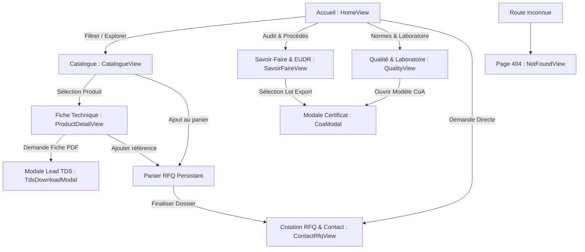
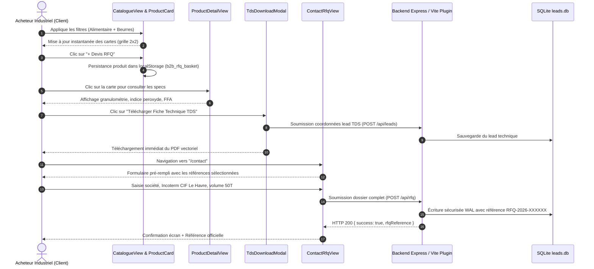
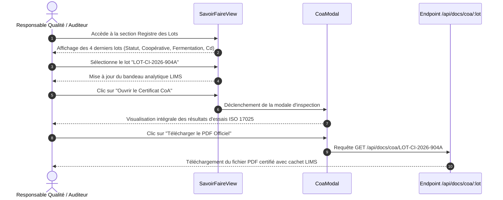
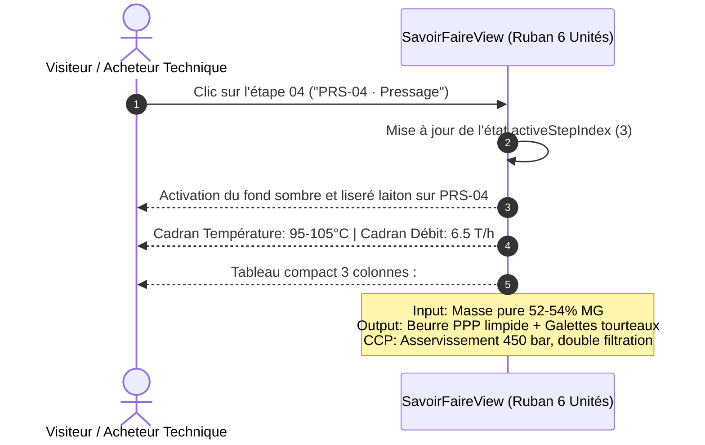

# Parcours Utilisateur & Cartographie Applicative (APP_FLOW)

## Plateforme Agro-Industrielle B2B : Transformation & Exportation de Cacao Pur

* **Projet :** Agro-Industrial Cocoa Processing Platform
* **Document :** 02_APP_FLOW.md
* **Version :** 1.2.0
* **Date :** Octobre 2026

---

## 1. Cartographie des Vues & Routes

L'application est construite comme une Single Page Application (SPA) réactive à haute performance. L'état de navigation est synchronisé avec l'historique du navigateur via la fonction `parseLocation()` et les événements `popstate`.

### Table des Vues Principales

| Vue | Route Virtuelle | Composant Source | Fonction Métier Principale |
| :--- | :--- | :--- | :--- |
| **Accueil** | `/` | [`HomeView.tsx`](file:///d:/Bureau/Site%20Agroalimentaire/agro-industrial-cocoa-processing/src/components/home/HomeView.tsx) | Hero industriel, 3 segments filières, 3 piliers de gouvernance, extraits du catalogue technique. |
| **Savoir-Faire** | `/savoir-faire` | [`SavoirFaireView.tsx`](file:///d:/Bureau/Site%20Agroalimentaire/agro-industrial-cocoa-processing/src/components/savoir-faire/SavoirFaireView.tsx) | Ruban continu des 6 ateliers, KPIs EUDR géoréférencés, registre des lots industriels libérés. |
| **Catalogue** | `/catalogue` | [`CatalogueView.tsx`](file:///d:/Bureau/Site%20Agroalimentaire/agro-industrial-cocoa-processing/src/components/catalogue/CatalogueView.tsx) | Moteur à facettes ultra-réactif (< 15 ms), filtrage combinatoire (Secteur / Famille / Recherche). |
| **Fiche Produit** | `/produit/:id` | [`ProductDetailView.tsx`](file:///d:/Bureau/Site%20Agroalimentaire/agro-industrial-cocoa-processing/src/components/product/ProductDetailView.tsx) | Spécifications complètes ISO, microbiologie PCR, contaminants métaux lourds, emballages FCL. |
| **Qualité & Labo** | `/qualite` | [`QualityView.tsx`](file:///d:/Bureau/Site%20Agroalimentaire/agro-industrial-cocoa-processing/src/components/quality/QualityView.tsx) | 8 certifications internationales, matrice des protocoles ISO 17025, protocole de Positive Release. |
| **Cotation RFQ** | `/contact` | [`ContactRfqView.tsx`](file:///d:/Bureau/Site%20Agroalimentaire/agro-industrial-cocoa-processing/src/components/contact/ContactRfqView.tsx) | Formulaire de conversion B2B, échantillons R&D, volumes FCL, Incoterms, anti-bot Turnstile invisible. |
| **Erreur 404** | `/404` (fallback) | [`NotFoundView.tsx`](file:///d:/Bureau/Site%20Agroalimentaire/agro-industrial-cocoa-processing/src/components/common/NotFoundView.tsx) | Écran sobre de redirection vers le catalogue ou l'accueil en cas d'URL non reconnue. |

---

## 2. Diagrammes des Flux d'Interaction Clés

### Parcours A : Découverte Commerciale & Conversion RFQ

Ce flux illustre le parcours classique d'un acheteur industriel ou d'un responsable R&D agroalimentaire.

---

### Parcours B : Consultation du Registre des Lots & Certification CoA

Ce flux illustre la vérification de conformité par un responsable Qualité ou un auditeur export.

---

### Parcours C : Ruban Continu des 6 Étapes de Raffinage

Ce flux illustre l'interaction de découverte technique sur le pipeline d'ingénierie.

---

## 3. Gestion des États Globaux

L'application orchestre son état de manière fluide à la racine dans [`App.tsx`](file:///d:/Bureau/Site%20Agroalimentaire/agro-industrial-cocoa-processing/src/App.tsx) :

1. **État du Panier RFQ (`selectedRfqProductIds: string[]`) :**
   * Initialisé au montage depuis `localStorage.getItem('b2b_rfq_basket')` ou initialisé à tableau vide `[]`.
   * Synchronisé immédiatement à chaque appel de `toggleRfqProduct(product)`.
   * Accessible en lecture par l'en-tête de navigation, le catalogue, les fiches produits et le formulaire de contact.

2. **État de la Navigation (`currentView` et `selectedProductId`) :**
   * Synchronisation bi-directionnelle avec `window.location.pathname` et `window.location.search`.
   * Défilement automatique vers le haut (`window.scrollTo({ top: 0, behavior: 'smooth' })`) lors de chaque transition de vue.
   * Mise à jour synchrone des balises documentaires SEO (`document.title`, `meta description`, balises OpenGraph).

3. **État des Modales Modulaires :**
   * `isTdsModalOpen` + `activeTdsProduct` : Modale de capture de lead technique.
   * `isCoaModalOpen` + `activeCoaBatch` : Modale de consultation et d'export de Certificat d'Analyse.
   * `isTermsModalOpen` : Modale des Conditions Générales de Vente B2B export.
   * `isPrivacyModalOpen` : Modale de conformité RGPD et politique de gestion des données des leads.

4. **Notifications & Feedback d'Erreur :**
   * Gestion réactive des alertes de soumission dans le formulaire RFQ (indicateur de chargement, message de succès stylisé avec référence unique, bannière d'erreur explicite en cas de rejet réseau ou validation Zod).
