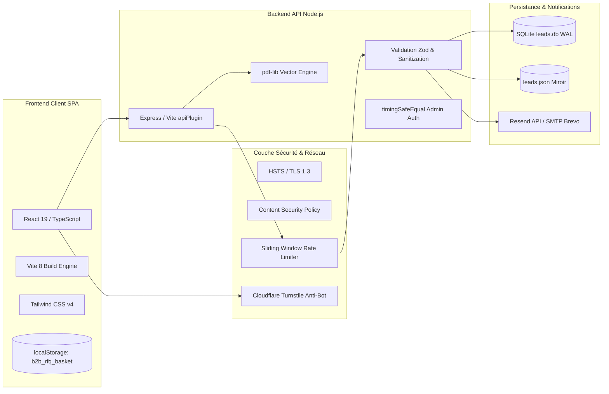

# Technical Requirements Document (TRD)

## Plateforme Agro-Industrielle B2B : Transformation & Exportation de Cacao Pur

* **Projet :** Agro-Industrial Cocoa Processing Platform
* **Document :** 04_TRD.md
* **Version :** 1.2.0
* **Date :** Octobre 2026

---

## 1. Architecture Logicielle Globale

La plateforme est conçue selon une architecture Jamstack moderne, découplant l'interface utilisateur statique haute performance des micro-services transactionnels d'exportation.



---

## 2. Pile Technologique

### 2.1 Couche Frontend
* **Framework :** React 19 avec typage TypeScript strict (`"strict": true` sans `any` toléré).
* **Outillage de Build :** Vite 8 avec compilation ultra-rapide (production bundle généré en moins de 2.5 secondes).
* **Moteur de Styles :** Tailwind CSS v4 avec déclaration native des variables chromatiques et de typographie sans runtime JavaScript.
* **Bibliothèque d'Iconographie :** `lucide-react` restreinte aux seuls glyphes utilitaires essentiels.

### 2.2 Couche Backend & Middleware
* **Runtime :** Node.js 20+ LTS.
* **Serveur HTTP :** Express 4.x pour le runtime de production et middleware personnalisé Vite (`server/apiPlugin.ts`) pour l'environnement de développement local.
* **Moteur de Données Relationnel :** `better-sqlite3` avec activation impérative du mode Write-Ahead Logging (`PRAGMA journal_mode = WAL;`) pour des écritures transactionnelles instantanées et concurrentes.
* **Générateur Documentaire :** `pdf-lib` sans dépendance native C pour une génération autonome et sécurisée des fiches TDS et CoA.
* **Services d'E-mail Transactionnel :** Connecteur universel compatible avec l'API moderne Resend (`resend`) et le protocole standardisé `nodemailer` pour serveurs SMTP professionnels.

---

## 3. Sécurité & Durcissement OWASP

La plateforme a subi un audit automatisé Herozion complet et applique rigoureusement les préconisations du Top 10 OWASP :

### 3.1 En-têtes HTTP de Sécurité ([`server/securityHeaders.ts`](file:///d:/Bureau/Site%20Agroalimentaire/agro-industrial-cocoa-processing/server/securityHeaders.ts))
* **Content-Security-Policy (CSP) Stricte :**
  ```http
  Content-Security-Policy: default-src 'self'; script-src 'self' 'unsafe-inline' https://challenges.cloudflare.com; style-src 'self' 'unsafe-inline' https://fonts.googleapis.com; font-src 'self' https://fonts.gstatic.com; img-src 'self' data: blob: https://images.unsplash.com; connect-src 'self' https://challenges.cloudflare.com; frame-src https://challenges.cloudflare.com; object-src 'none'; base-uri 'self'; form-action 'self';
  ```
* **Protection Anti-Clickjacking :** `X-Frame-Options: DENY` et directive CSP `frame-ancestors 'none'`.
* **Transport Strictement Chiffré :** `Strict-Transport-Security: max-age=31536000; includeSubDomains; preload` forçant HTTPS sur 1 an.
* **Protection Anti-Sniffing & COOP :** `X-Content-Type-Options: nosniff`, `Cross-Origin-Opener-Policy: same-origin-allow-popups`.
* **Restriction Matérielle :** `Permissions-Policy: camera=(), microphone=(), geolocation=(), payment=(), usb=()` interdisant l'accès aux périphériques.

### 3.2 Assainissement des Entrées & Validation Zod ([`server/validation.ts`](file:///d:/Bureau/Site%20Agroalimentaire/agro-industrial-cocoa-processing/server/validation.ts))
* **Fonction `sanitizeString` :** Neutralisation systématique des balises `<script>`, des balises HTML et des caractères de contrôle ASCII.
* **Protection Anti-Injection HTML dans les E-mails :** Échappement rigoureux via `escapeHtml` sur tous les paramètres textuels transmis dans les modèles d'accusé de réception et d'alerte commerciale.
* **Filtrage des E-mails Jetables :** Rejet systématique des domaines temporaires (Mailinator, GuerrillaMail, TempMail, Yopmail, etc.) afin de garantir la qualité des leads industriels.

### 3.3 Vérification Anti-Bot Invisible (Cloudflare Turnstile)
* **Mode Invisible Réel :** Utilisation de la clé publique de test invisible `1x00000000000000000000BB` en développement et de clés de site officielles en production.
* **Vérification Cryptographique Côté Serveur :** Requête POST vers `https://challenges.cloudflare.com/turnstile/v0/siteverify` avec l'adresse IP cliente et la clé secrète. En cas de non-concordance ou d'absence de jeton, la requête est rejetée avec le code `403 Forbidden`.

### 3.4 Protection Anti-Brute Force & Rate Limiting ([`server/rateLimiter.ts`](file:///d:/Bureau/Site%20Agroalimentaire/agro-industrial-cocoa-processing/server/rateLimiter.ts))
* **Moteur Sliding Window en Mémoire :**
  * Soumissions RFQ / Contact : **Plafond strict de 5 requêtes par 15 minutes par IP**.
  * Téléchargements PDF : **Plafond de 30 requêtes par minute par IP**.
  * Accès Administratif `/api/leads*` : **Plafond de 10 requêtes par 15 minutes par IP**.
* **Réponse Standardisée :** Renvoi immédiat du statut HTTP `429 Too Many Requests` avec en-têtes standardisés `Retry-After`.

### 3.5 Authentification Administrative Constante ([`server/auth.ts`](file:///d:/Bureau/Site%20Agroalimentaire/agro-industrial-cocoa-processing/server/auth.ts))
* **Neutralisation des Attaques Temporelles :** Comparaison de la clé `ADMIN_API_KEY` effectuée via `crypto.timingSafeEqual` sur des hachages cryptographiques SHA-256.
* **Refus de Démarrage Non Sécurisé :** En environnement de production, le serveur refuse catégoriquement de démarrer si `ADMIN_API_KEY` n'est pas définie dans l'environnement.

---

## 4. Politique de Persistance Locale & Cache

* **Clé `b2b_rfq_basket` :** Stocke un tableau JSON d'identifiants de produits (ex: `["beurre-naturel", "poudre-alcalinisee-20-22"]`).
* **Résilience aux Rafraîchissements :** Si l'acheteur navigue sur d'autres sites ou recharge la page, sa sélection reste intacte.
* **Durée de Vie du Cache PDF :** En-têtes HTTP de distribution documentaire configurés avec `Cache-Control: public, max-age=86400, s-maxage=604800` garantissant une mise en cache CDN efficace sans re-génération superflue.

---

## 5. Contrôles de Qualité, Intégration Continue & Scripts

Le projet maintient une politique de compilation sans compromis :

```bash
# 1. Contrôle statique de typage TypeScript strict (Zero Warning / Zero Error)
npm run lint
# Exécute: tsc --noEmit

# 2. Compilation de production Vite et génération du bundle optimisé
npm run build
# Exécute: vite build

# 3. Démarrage du serveur de développement avec rechargement à chaud
npm run dev
# Exécute: vite (avec plugin middleware API actif sur le port 3000)
```

Toute modification apportée au code source doit obligatoirement valider `npm run lint` et `npm run build` avant d'être consignée dans `SESSION_STATE.md` et transmise au dépôt Git.
