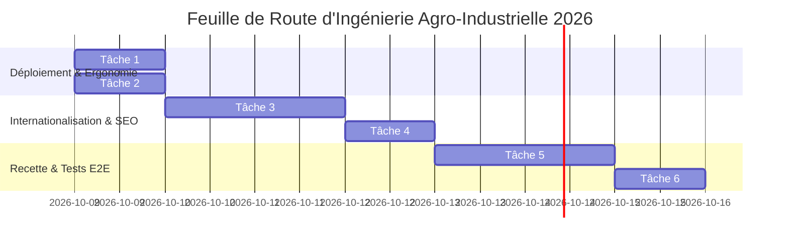

# Plan d'Implémentation & Feuille de Route (IMPLEMENTATION_PLAN)

## Plateforme Agro-Industrielle B2B : Transformation & Exportation de Cacao Pur

* **Projet :** Agro-Industrial Cocoa Processing Platform
* **Document :** 06_IMPLEMENTATION_PLAN.md
* **Version :** 1.2.0
* **Date :** Octobre 2026

---

## 1. Synthèse Chronologique des Réalisations (Phases 1 à 15)

L'état d'avancement complet du projet est consigné et tenu à jour dans le journal d'ingénierie [`SESSION_STATE.md`](file:///d:/Bureau/Site%20Agroalimentaire/SESSION_STATE.md). Les jalons majeurs suivants ont été validés :

1. **Audit & Refondation Typographique (Phases 1 à 3) :**
   * Élimination des polices génériques et des ombres portées floues.
   * Adoption du standard néo-grotesque d'entreprise (`Source Sans 3`) couplé à `JetBrains Mono` (`font-mono`) pour toutes les grandeurs de laboratoire et métriques de débit.
   * Restructuration de la page d'accueil en 3 piliers industriels vérifiables.

2. **Harmonisation Géométrique & Arrondis (Phase 4) :**
   * Normalisation des rayons de courbure sur l'ensemble des 16 composants du site : `rounded-[8px]` pour les conteneurs/sections, `rounded-[6px]` pour les boutons et inputs, `rounded-[4px]` pour les badges de statut.

3. **Sécurité OWASP, Audit Herozion & Backend Transactionnel (Phase 5) :**
   * Score certifié de **100/100 (Grade A, Mention « Excellent »)**, 0 vulnérabilité restante.
   * Moteur relationnel SQLite avec WAL (`leads.db`) doublé d'un miroir JSON (`leads.json`).
   * Protection administrative par temps constant (`timingSafeEqual`) sur `/api/leads*`.
   * En-têtes HTTP de sécurité OWASP (CSP stricte, HSTS, X-Frame-Options, Permissions-Policy).
   * Limitation de débit anti-DDoS (Rate Limiter Sliding Window).

4. **Persistance du Panier RFQ & Nettoyage Métier (Phase 6) :**
   * Panier initialisé à zéro ou restauré dynamiquement depuis `localStorage.getItem('b2b_rfq_basket')`.
   * Sélecteur de pays obligatoire et suppression des pré-sélections artificielles.

5. **Épuration Industrielle des Procédés & Visuels (Phases 7 à 10) :**
   * Ruban continu des 6 étapes sans troncature avec débits massiques en T/h (`SavoirFaireView.tsx`).
   * Éradication des icônes décoratives génériques au profit de trigrammes normatifs (`REC-01`, `SEG · 01 / CHO`, `ISO 17025`, `EUDR`).
   * Mire technique de laboratoire haute fidélité (`ProductImage.tsx`) affichant le SKU et le conditionnement officiel.

6. **Refonte Barry Callebaut des Cartes & Catalogue (Phases 11 & 12) :**
   * Barre d'outils monobloc unifiée avec filtre combinatoire et indicateur d'inventaire officiel.
   * Cartes produits en grille aérée 2x2, fond minéral doux `#FAF7F2`, clic intégral et ligne d'action épurée (`ProductCard.tsx`).

7. **Sécurité Anti-Bot Silencieuse (Phase 13) :**
   * Remplacement de la clé de test visible par la clé officielle Cloudflare Turnstile invisible (`1x00000000000000000000BB`).
   * Élimination de l'avertissement rouge de test et intégration non-intrusive.

8. **Harmonisation des Micro-Interactions (Phases 14 & 15) :**
   * Alignement strict de la surbrillance de bordure dorée (`hover:border-[#C29958] transition-colors group`) et de la réaction de titre (`group-hover:text-[#4A2C21]`) sur l'ensemble des cartes de l'accueil, des certifications qualité, des informations usine et des métriques EUDR.
   * Remplacement du bloc de cartes dupliqué de l'Accueil par le composant officiel `<ProductCard />`.

---

## 2. Chantiers d'Optimisation Restants & Roadmap

### Chantiers Prioritaires Détaillés

#### Chantiers P1 : Basculeur Vue Table / Grille pour le Catalogue Technique
* **Objectif :** Permettre aux acheteurs industriels et formulateurs R&D de basculer en un clic entre la vue cartes aérées 2x2 et une vue tableau synthétique (Table Spreadsheet) listant simultanément les 9 ingrédients avec tri par matière grasse, pH et granulométrie.
* **Composant cible :** [`CatalogueView.tsx`](file:///d:/Bureau/Site%20Agroalimentaire/agro-industrial-cocoa-processing/src/components/catalogue/CatalogueView.tsx).

#### Chantiers P2 : Internationalisation Exhaustive (i18n Bilingue FR / EN)
* **Objectif :** Finaliser le basculement complet de l'interface en langue anglaise pour les acheteurs internationaux (Europe du Nord, États-Unis, Asie).
* **Périmètre :** Traduction des spécifications physico-chimiques, des clauses de conformité EUDR et des accusés de réception transactionnels.

#### Chantiers P3 : Optimisation SEO B2B & Schémas Données Structurées (JSON-LD)
* **Objectif :** Positionnement naturel sur les requêtes d'ingénierie d'exportation (« pure prime pressed cocoa butter exporter », « alkalized cocoa powder 10-12 supplier San Pedro », « EUDR compliant cocoa liquor »).
* **Livrables :** Balises `schema.org` de type `Product` et `Organization`, métadonnées OpenGraph d'exportation haute résolution (`og-share.jpg`).

#### Chantiers P4 : Tests End-to-End du Tunnel de Cotation RFQ
* **Objectif :** Validation automatisée du parcours complet de soumission depuis le clic sur le produit jusqu'à la persistance en base SQLite et la réception des e-mails d'alerte.

---

## 3. Protocole de Validation Continue & Discipline d'Ingénierie

Pour préserver l'intégrité absolue de la plateforme, tout agent ou développeur intervenant sur le dépôt doit exécuter le cycle de contrôle suivant :

1. **Contrôle Statique :** Exécution de `npm run lint` (`tsc --noEmit`). Le code doit retourner un code de sortie 0 sans aucun avertissement.
2. **Contrôle de Bundle :** Exécution de `npm run build` (`vite build`). Vérification que les chunks de production sont générés sous le seuil maximal de 500 Ko gzip.
3. **Mise à Jour de Session :** Consignation systématique de la phase traitée dans [`SESSION_STATE.md`](file:///d:/Bureau/Site%20Agroalimentaire/SESSION_STATE.md).
4. **Validation Git :** Commit atomique documenté avec message conventionnel (`feat:`, `fix:`, `style:`, `refactor:`) et synchronisation sur la branche distante `origin main`.
